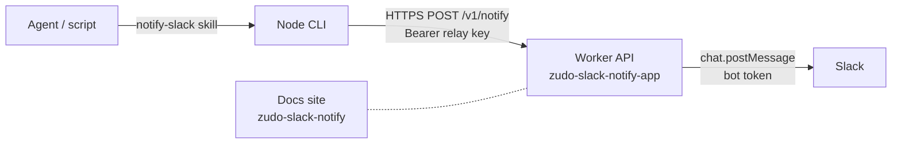

zudo-slack-notify is a small personal notification relay. A local agent or script wants to tell a human "the build finished" or "this needs your approval", and the message should land in a chosen Slack channel without the caller ever holding a Slack token.

It is three parts:

- **A Cloudflare Worker API** (`POST /v1/notify`) that authenticates the caller, validates a small JSON message, and posts it to Slack with `chat.postMessage`.
- **A Node CLI** (`app/cli/notify.ts`) that validates locally, sends the request, and maps the outcome to an exit code.
- **A Claude Code agent skill** (`notify-slack`) that lets an agent send a notification with the facts of the moment.

## Architecture

The Worker holds the only Slack credential. Callers hold a narrower relay key that cannot call arbitrary Slack methods. Channels are never named by callers: they pick a **target alias** such as `dev` or `releases`, and the Worker resolves it from its own configuration.

## Domains

| Unit | Worker name             | Domain                                      |
| ---- | ----------------------- | ------------------------------------------- |
| API  | `zudo-slack-notify-app` | `https://zudo-slack-notify-app.zudolab.dev` |
| Docs | `zudo-slack-notify`     | `https://zudo-slack-notify.zudolab.dev`     |

The sender endpoint is `https://zudo-slack-notify-app.zudolab.dev/v1/notify`. There is no `workers.dev` hostname and no preview URL.

## Where the pieces live

| Piece         | Path                                              |
| ------------- | ------------------------------------------------- |
| Worker source | `app/src/index.ts`, `app/src/notification.ts`     |
| CLI           | `app/cli/notify.ts`                               |
| Slack app     | `app/slack-app-manifest.json`                     |
| Examples      | `app/examples/*.json`                             |
| Agent skill   | `skills/notify-slack/`                            |
| Operator tools | `scripts/push-worker-secrets.mjs`, `scripts/smoke.sh` |

## What it deliberately does not do

:::info[Non-goals]
The service delivers one message to one named destination, once, and reports what it knows. Everything below is intentionally absent.
:::

- **No approvals.** There are no buttons, callbacks, or interactivity endpoint. A notification never grants permission to publish, merge, or deploy. See [Agent skill](../agent-skill/).
- **No queue, no storage, no database.** One valid request causes exactly one Slack attempt. There is no offline buffering and no history; Slack is the history.
- **No deduplication and no idempotency key.** `requestId` identifies an API attempt only.
- **No automatic retries**, in the Worker or in the CLI. A timeout can happen after Slack accepted the message, so a blind retry can duplicate it. See [Delivery semantics](../api/delivery-semantics/).
- **No raw Block Kit and no mentions.** Caller text is rendered literally, so task text cannot turn into an accidental `@channel`.
- **One shared relay key and one workspace.** Every holder of the key can use every configured target.

Continue with [Getting started](../getting-started/) to stand it up, or read the [Design decisions](../design/) for the reasoning.
