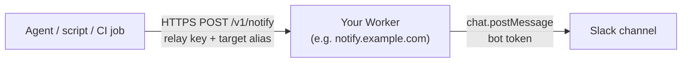

zudo-slack-notify is a small, self-hosted Slack notification relay. It lets an AI agent, a build script, or any local tool tell a human something in Slack, such as "the build finished" or "this needs your review", **without that caller ever holding a Slack token**.

You deploy the relay as your own Cloudflare Worker. The Worker keeps the Slack bot token to itself. Your scripts get a narrower **relay key** that can do exactly one thing: post a plain, validated notification to one of the destinations you configured.

The project ships three parts:

- **A Cloudflare Worker API** (`POST /v1/notify`) that authenticates the caller, validates a small JSON message, renders it as Slack blocks, and posts it with `chat.postMessage`.
- **A Node CLI** that validates locally, sends the request, and turns the outcome into an exit code. See [CLI](../cli/).
- **A Claude Code agent skill** (`notify-slack`) that lets an agent send a notification with the facts of the moment. See [Agent skill](../agent-skill/).

## How a notification travels



1. The caller sends `POST /v1/notify` to your Worker with the relay key and a small JSON body naming a **target alias**, not a channel.
2. The Worker checks the key, validates the body, looks up the alias in its own configuration, and renders the message.
3. The Worker posts to Slack with the bot token, verifies Slack's receipt, and tells the caller what happened.

Any HTTP client works. The CLI and the agent skill are conveniences on top of the same endpoint, so you can call the relay from a shell script, a CI job, or your favorite language.

## Core concepts

### Relay key and bot token

Two secrets, held by different parties:

| Secret       | Held by              | Can do                                              |
| ------------ | -------------------- | --------------------------------------------------- |
| Bot token    | The Worker only      | Post to Slack channels the bot has been invited to  |
| Relay key    | Your scripts, agents | Call `POST /v1/notify` on your Worker, nothing else |

A leaked relay key lets someone send notifications to your configured targets. It cannot read Slack, call other Slack methods, or pick an arbitrary channel. You rotate it without touching Slack. See [Design decisions](../design/) for the reasoning.

### Target aliases

Callers never name a Slack channel. They pick an alias such as `dev` or `releases`, and the Worker resolves it through its `SLACK_TARGETS` secret, a JSON map of alias to channel ID. An unknown alias is refused before Slack is contacted.

### Message kinds

Every notification has a `kind`, which becomes the heading: `info` (the default), `success`, `warning`, `error`, or `action_required`. A `title`, a `source` label, up to six `fields`, and up to three HTTPS `links` are optional. Text is rendered literally, so a message cannot trigger mentions or `@channel`.

### A minimal request

```http
POST /v1/notify HTTP/1.1
Host: notify.example.com
Authorization: Bearer <your-relay-key>
Content-Type: application/json

{ "target": "dev", "kind": "success", "message": "Build finished." }
```

A delivered message answers `200`:

```json
{
  "ok": true,
  "delivery": "sent",
  "requestId": "0d6c1c53-6d6c-4f7f-9a3e-7f9d5a5b7d11",
  "target": "dev",
  "channel": "C0123456789",
  "ts": "1750000000.000001"
}
```

The full schema, limits, and rendering rules are in [POST /v1/notify](../api/notify/).

### Delivery states

Every response, success or failure, carries a `delivery` field that says what the Worker knows about Slack:

- **`sent`**: Slack accepted the message and the Worker verified the receipt.
- **`not_sent`**: the message definitely did not post, for example a bad key, an invalid body, or an explicit Slack rejection.
- **`unknown`**: the Worker cannot tell, for example because Slack timed out after it may have accepted the post. Check the channel before sending again.

Failures also carry `error.code` and `retryable`. See [Delivery semantics](../api/delivery-semantics/) and the [error catalog](../api/errors/).

### Threading

The success response returns `ts`, the Slack timestamp of the posted message. Send a later notification to the **same target** with `threadTs` set to that value, and it lands as a reply in the thread. The Worker does not remember receipts; the caller keeps the `ts`.

## What it deliberately does not do

:::info[Non-goals]
The service delivers one message to one named destination, once, and reports what it knows. Everything below is intentionally absent.
:::

- **No approvals.** There are no buttons, callbacks, or interactivity endpoint. A notification never grants permission to publish, merge, or deploy. See [Agent skill](../agent-skill/).
- **No queue, no storage, no database.** One valid request causes exactly one Slack attempt. There is no offline buffering and no history; Slack is the history.
- **No deduplication and no idempotency key.** `requestId` identifies an API attempt only.
- **No automatic retries**, in the Worker or in the CLI. A timeout can happen after Slack accepted the message, so a blind retry can duplicate it. See [Delivery semantics](../api/delivery-semantics/).
- **No raw Block Kit and no mentions.** Caller text is rendered literally, so task text cannot turn into an accidental `@channel`.
- **One shared relay key and one workspace.** Every holder of the key can use every configured target.

Continue with [Getting started](../getting-started/) to run your own relay, read the [Design decisions](../design/) for the reasoning, or see [Development](../development/) for how the repository is laid out.
